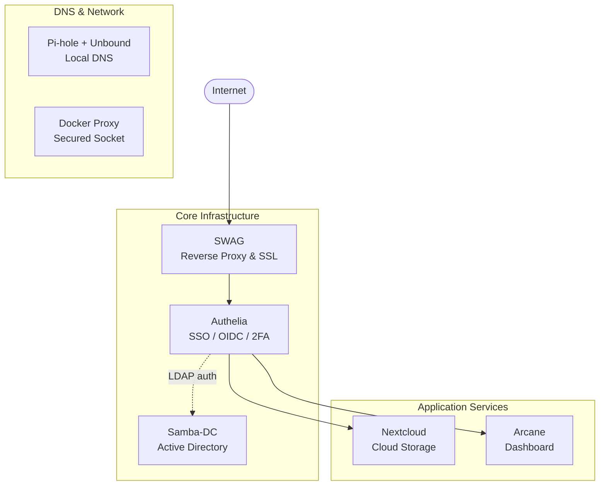

# Docker Compose Infrastructure Stack

Self-hosted infrastructure stack: SSO/OIDC, Active Directory, reverse proxy, DNS — optimized for minimal resource usage.

> **This is a curated, secrets-free extract of my production Docker Compose stack.** The full setup runs on a Debian 13 homelab server managed with OpenMediaVault, with additional services and configuration not included here. Only compose files are shared — `.env` files are excluded as they contain secrets/passwords.

---

## Why this stack?

**Why Docker Compose instead of Kubernetes?**
For a single-node setup, Kubernetes adds orchestration overhead without real benefit. Docker Compose gives you the same containerized services with a fraction of the resource usage — the entire stack (25+ containers) runs at ~28W idle and ~3GB RAM. I run a separate [Talos Kubernetes cluster](https://github.com/dmuiX/k8s-cluster-talos) for learning and testing — but for production use on a single host, Compose is the pragmatic choice.

**Why Authelia instead of Keycloak?**
Keycloak is powerful but heavy — it needs its own database, eats 500MB+ RAM at idle, and is built for enterprise-scale identity federation. Authelia is lightweight, config-file-driven, and does exactly what's needed: SSO, OIDC, 2FA — without the resource overhead. Paired with SWAG as reverse proxy, it adds authentication to any service with a single nginx directive.

**Why Samba-DC instead of FreeIPA or LDAP-only?**
Samba-DC is one of the few realistic ways to run an AD-compatible domain controller inside Docker — with DNS, Kerberos, LDAP, and Group Policy support. The main reason: centralized SSO for both Windows and Mac clients, with domain join, AD-native group management, and Kerberos authentication out of the box. FreeIPA didn't work well in Docker when I tested it. Plain OpenLDAP would handle basic authentication but doesn't give you the AD functionality needed for Windows domain join and Group Policy.

**Why Uptime Kuma instead of Prometheus/Grafana?**
A full-blown Prometheus stack is not necessary for a single-node host. Uptime Kuma handles endpoint monitoring with email alerts when something goes down — that's all that's needed. Email alerting is configured through OpenMediaVault at the host level. For system stats, OMV, Arcane, or just `btop` on the host do the job without running a time-series database, exporters, and Grafana dashboards.

---

## Architecture Overview



---

## Services

| Folder | Service | Description |
| ------ | ------- | ----------- |
| [`1-swag/`](1-swag/) | **SWAG** | Reverse proxy with automatic SSL (Let's Encrypt) |
| [`authelia/`](authelia/) | **Authelia** | Single Sign-On & OIDC provider |
| [`samba-dc/`](samba-dc/) | **Samba DC** | Active Directory domain controller |
| [`pihole/`](pihole/) | **Pi-hole** | DNS server with ad-blocking (+ Unbound) |
| [`dockerproxy/`](dockerproxy/) | **Docker Proxy** | Secured access to the Docker socket |
| [`arcane/`](arcane/) | **Arcane** | Homelab dashboard / service overview |
| [`nextcloud/`](nextcloud/) | **Nextcloud** | Self-hosted cloud storage — initial setup via browser on first start |

---

## Auth Layer (Samba-DC + Authelia)

Samba-DC provides an **Active Directory** backend. Authelia sits in front of services and handles:

- **OIDC** authentication for applications
- **2FA / MFA** enforcement
- Single Sign-On across all proxied services

### DNS Records

The file [`samba-dc/dns-records`](samba-dc/dns-records) contains DNS entries for your domain (e.g. `domain.org`).

```bash
# Import DNS records into Samba-DC
./samba-dc/import-dns-records.sh

# Register a new OIDC client with Authelia
./authelia/add-client.sh
```

### Authelia Secrets

Authelia loads secrets from files in `authelia/secrets/` (gitignored — create them on each host).

| Secret file | Purpose | Min. length |
| --- | --- | --- |
| `AUTHELIA_PASSWORD` | Password for the Authelia LDAP service account | 16 chars |
| `EMAIL_PASSWORD` | Password for the notification mail account | 16 chars |
| `ENCRYPTION_SECRET` | Storage encryption key | **20 chars** (Authelia enforced) |
| `JWT_SECRET` | JWT signing secret (used for password reset) | 20 chars |
| `SESSION_SECRET` | Session cookie signing secret | 20 chars |
| `oidc/HMAC_SECRET` | HMAC secret for OIDC token signing | 32 chars |

Generate all secrets at once:

```bash
mkdir -p authelia/secrets/oidc
openssl rand -base64 32 > authelia/secrets/AUTHELIA_PASSWORD
openssl rand -base64 32 > authelia/secrets/EMAIL_PASSWORD
openssl rand -base64 48 > authelia/secrets/ENCRYPTION_SECRET
openssl rand -base64 48 > authelia/secrets/JWT_SECRET
openssl rand -base64 48 > authelia/secrets/SESSION_SECRET
openssl rand -base64 48 > authelia/secrets/oidc/HMAC_SECRET
```

> **Note:** [`authelia/config/configuration.yml`](authelia/config/configuration.yml) is an example configuration.
> At minimum, adjust all `domain.org` references and the LDAP `user` DN to match your setup.

See [`authelia/authelia.yml`](authelia/authelia.yml) for the expected secret paths.

---

## Samba DC

Samba-DC runs on a **macvlan** interface with a dedicated LAN IP so it can act as a proper AD domain controller (ports 53, 389, 445, 636).

The domain admin password is passed as a Docker secret — create the file before starting:

```bash
# Generate a random admin password
openssl rand -base64 32 > samba-dc/samba_admin_pass
```

> `samba_admin_pass` is gitignored and must be created manually on each host.

---

## Reverse Proxy (SWAG)

SWAG handles all inbound traffic, SSL termination, and forwards requests to backend services.
Custom proxy configs live in [`1-swag/custom-proxies/`](1-swag/custom-proxies/).

Create `1-swag/cloudflare.ini` (gitignored) with your Cloudflare credentials:

```ini
# Option A – API Token (recommended, scoped to Zone:DNS:Edit)
dns_cloudflare_api_token = YOUR_CLOUDFLARE_API_TOKEN

# Option B – Global API Key (legacy)
# dns_cloudflare_email = your@email.com
# dns_cloudflare_api_key = YOUR_GLOBAL_API_KEY
```

---

## DNS (Pi-hole + Unbound)

Pi-hole acts as the local DNS server with ad-blocking.
Unbound runs as a sidecar container (`madnuttah/unbound`) and is configured via the image's built-in defaults.

---

## Environment Variables

Several services rely on the following variables being present in the shell environment:

| Variable | Description | Example |
| --- | --- | --- |
| `TZ` | Timezone | `Europe/Berlin` |
| `PUID` | User ID for file permissions | `1000` |
| `PGID` | Group ID for file permissions | `1000` |

On this host these are injected globally by **OpenMediaVault**. If you run the stack outside OMV, set them in your shell or add them to each service's `.env` file:

```bash
export TZ=Europe/Berlin
export PUID=1000
export PGID=1000
```

---

## Docker Networks

All services use **external** Docker networks that must exist on the host before starting:

```bash
docker network create swag
docker network create dockerproxy
docker network create pihole
docker network create -d macvlan \
  --subnet=192.168.178.0/24 \
  --gateway=192.168.178.1 \
  -o parent=eth0 \
  macvlan0
```

> `macvlan0` is only required by Samba-DC (needs a dedicated IP on the LAN). Adjust subnet, gateway, and parent interface to match your network.

---

## Container Registry (`dhi.io`)

Images are pulled from [dhi.io](https://dhi.io) instead of Docker Hub for faster and more complete CVE fixes. Some images here use it (`uptime-kuma`, `postgres`, `redis`).
If you'd rather use the official images, drop-in replacements:

| `dhi.io` image | Official replacement |
| --- | --- |
| `dhi.io/uptime-kuma:2` | `louislam/uptime-kuma:2` |
| `dhi.io/postgres:18-alpine3.22` | `postgres:18-alpine` |
| `dhi.io/redis:8` | `redis:8-alpine` |

---

## Backups

Handled via BorgBackup at the host level (managed through OpenMediaVault, not part of this Compose stack).

---

## Getting Started

1. Clone the repo
2. Copy each `*.env` file (not included) and fill in your values
3. For Authelia: define required secrets in the `authelia/` folder
4. Start the stack — recommended order:

   ```text
   samba-dc → pihole → authelia → swag → remaining services
   ```
